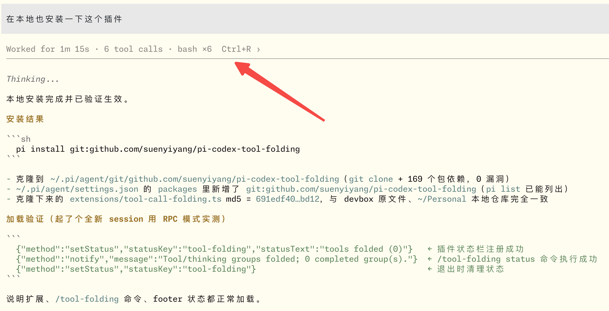

# pi-codex-tool-folding

Fold a whole run of tool calls into one quiet line in [Pi](https://pi.dev).



While Pi works, dozens of tool calls scroll past and push the actual answer off the screen. This extension groups every tool call belonging to one agent run into a single collapsed summary line:

```
Worked for 12s · 4 tool calls · bash ×2, read, edit  Ctrl+R ›
────────────────────────────────────────────────────────────
```

The final answer of the run stays fully visible right below that line. Failed tool calls turn the summary yellow and add a `N failed tools` segment.

## Features

- **One line per run** — every tool call between two user prompts collapses into a summary with duration, count, and per-tool breakdown (`bash ×2, read, edit`).
- **Answers stay readable** — assistant messages that only exist to carry tool calls are hidden; only the run's final text remains.
- **Failures surface** — failed tool calls are counted in the summary and highlighted in yellow.
- **Expand on demand** — `Ctrl+R`, a left click on the summary line, or `/tool-folding show` brings the full detail back.
- **Session resume aware** — on session start the groups are rebuilt from the session transcript, so restored history is folded too.
- **Non-destructive** — Pi's own `Ctrl+O` tool-details toggle is left untouched; this extension only owns the outer group fold.
- **No model-facing behavior** — purely a TUI presentation layer.

## Install

From GitHub:

```sh
pi install git:github.com/suenyiyang/pi-codex-tool-folding
```

As a single file (no package install):

```sh
cp extensions/tool-call-folding.ts ~/.pi/agent/extensions/
```

For a one-off run without installing:

```sh
pi -e ~/Personal/pi-codex-tool-folding
```

To remove:

```sh
pi remove git:github.com/suenyiyang/pi-codex-tool-folding
```

## Usage

Folding is on by default. Each completed run collapses automatically once it ends, and the footer shows the state:

```
tools folded (3)
```

| Input | Effect |
|---|---|
| `Ctrl+R` | Toggle folded / expanded for all completed runs |
| Left click on a summary line | Expand |
| `/tool-folding` | Same as `Ctrl+R` |
| `/tool-folding show` | Expand groups (compact) |
| `/tool-folding details` | Expand groups and show inner tool details |
| `/tool-folding hide` | Collapse groups |
| `/tool-folding on` | Enable auto-fold and collapse now |
| `/tool-folding off` | Disable folding entirely and show raw output |
| `/tool-folding status` | Report the current state |

`Ctrl+H` was avoided on purpose: many terminals send it as Backspace.

## How it works

1. Tool calls are grouped per agent run: `agent_start` opens a group, `tool_execution_start` / `tool_execution_end` register calls and results, and `agent_end` closes and folds the group.
2. `render` on `ToolExecutionComponent` is patched so the first tool call of a completed group draws the summary line and the rest draw nothing.
3. `render` on `AssistantMessageComponent` is patched so tool-call-only messages are dropped and the run's final message gets the summary line attached above it.
4. On `session_start` the groups are replayed from `sessionManager.buildContextEntries()`, so resumed sessions fold correctly.
5. Original `render` implementations are stashed on the prototypes under `Symbol.for(...)` keys and the shared state lives on `globalThis`, so extension reloads do not stack wrappers or lose fold state.

## Notes and limitations

- TUI only. In print/RPC mode there is nothing to fold.
- Requires a Pi version that exposes `registerShortcut`, `registerCommand`, and `ui.setStatus` (0.85.x or later).
- The extension patches Pi TUI component prototypes, so a future Pi release that changes those render signatures may break it until the wrapper is updated.

## Development

```sh
git clone https://github.com/suenyiyang/pi-codex-tool-folding
pi install ~/Personal/pi-codex-tool-folding   # or: pi -e .
```

Edit `extensions/tool-call-folding.ts` and restart the session (or reload extensions) to pick up changes.

## License

MIT. See [LICENSE](./LICENSE).
